# Fabric OneLake as Central Storage

## Lab Overview

This lab is designed to familiarize students with a variety of techniques for onboarding data into the Microsoft Fabric platform. Leveraging the renowned Gapminder visualization—which plots life expectancy against GDP per capita—the objective is to ingest and integrate data from four different sources into Fabric. Once onboarded, you will use Power BI to recreate the iconic scatter chart that dynamically shows global development trends over time.

The Gapminder scatter chart is a dynamic bubble chart that shows how countries develop over time. Each bubble represents a country, with its position based on income (GDP per capita) and life expectancy. The size of the bubble reflects the country's population, and the chart animates over the years to show how these values change.


## Lab Objectives

- Onboard Data to Azure SQL Server
- Onboard Data Sources into a Microsoft Fabric Lakehouse
- Virtualize data from an Amazon S3 bucket using shortcuts
- Mirror POPULATION table from the Snowflake database into a Microsoft Fabric Lakehouse 
- Ingest data from Azure SQL Database to Fabric Lakehouse
- Add Virtualized and Replicated Data to the Lakehouse
- Create the Views Needed for the Visualization
- Build Your Visualization

## Task 1: Onboard Data to Azure SQL Server

In this task, you will upload two datasets—**GDP_PER_CAPITA.csv** and **LIFE_EXPECTANCY.csv**—to an Azure SQL Server database using Azure Data Studio. This process involves creating appropriate tables within your SQL database and importing the CSV files into those tables.

1. In your JumpVM, search and select **Azure Data Studio**.

   

1. In **Azure Data Studio**'s Welcome page, select **Create a connection** to create a connection for Azure SQL database.

   

1. On the **Connection Details** pane, provide the following details and click on **Connect**.

   | Key    | Value                                                |
   |--------|------------------------------------------------------|
   | Server | sql-fabric-<inject key="DeploymentID" enableCopy="false"/>.database.windows.net |
   | Authentication type | SQL Login |
   | User name | labsqladmin |
   | Password | Smoothie@2025 |
   | Database | **olcs** |

   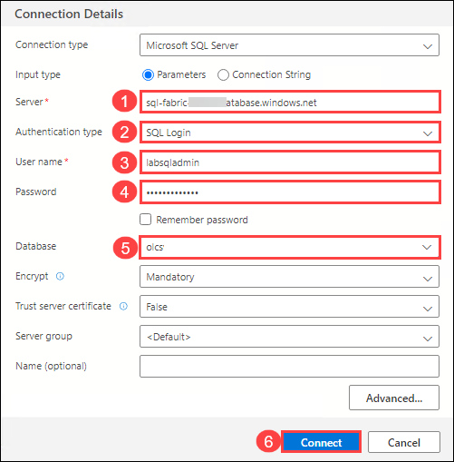

1. Once after the connection is added, click on **Connections** tab.

   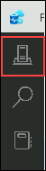


1. Under servers, right-click on **sql fabric** connection and select **Import wizard**.

   

1. On the **Import flat file wizard** pane, select **olcs** from the dropdown for **database the table is created in**, click on **Browse** and select `C:\fabricfiles\datasets\LIFE_EXPECTANCY.csv`. Click on **Next**.

   

1. On the **Preview** pane, click on **Next** and continue.

   

1. In the **Modify Columns** step, check the **Primary Key** boxes as shown for **country** and **year** columns. Click on **Import data**.

   

1. Click on **Done** to complete the Import data process.

1. Once imported, again right-click on **sql fabric** connection and select **Import wizard**.

   

1. On the **Import flat file wizard** pane, select **olcs** from the dropdown for **database the table is created in**, click on **Browse** and select `C:\fabricfiles\datasets\GDP_PER_CAPITA.csv`. Click on **Next**.

   

1. On the **Preview** pane, click on **Next** and continue.

   

1. In the **Modify Columns** step, check the **Primary Key** boxes as shown for **country** and **year** columns. Click on **Import data**.

   

1. Click on **Done** to complete the Import data process.

1. Wait for the import process to complete, and you will see the GDP_PER_CAPITA and LIFE_EXPECTANCY tables successfully loaded into your Azure SQL database.

   

## Task 2: Onboard Data Sources into a Microsoft Fabric Lakehouse

In this task, you will create a new workspace and Lakehouse in Microsoft Fabric. This setup will serve as the foundation for storing and managing the GapMinder datasets throughout the lab.

1. Open a browser and navigate to [https://app.fabric.microsoft.com](https://app.fabric.microsoft.com).

1. Once logged in, select the profile icon, and click on **Free Trial**.

   

1. In the next pane, click on **Activate**.

   

1. On the **Fabric Home** page, click on **New workspace** to create a workspace.

   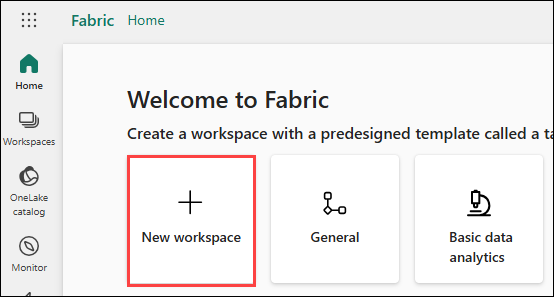

1. In **Create a workspace** pane, provide **Name** as **GapMinder-<inject key="DeploymentID" enableCopy="false"/>** and click on **Apply**.

   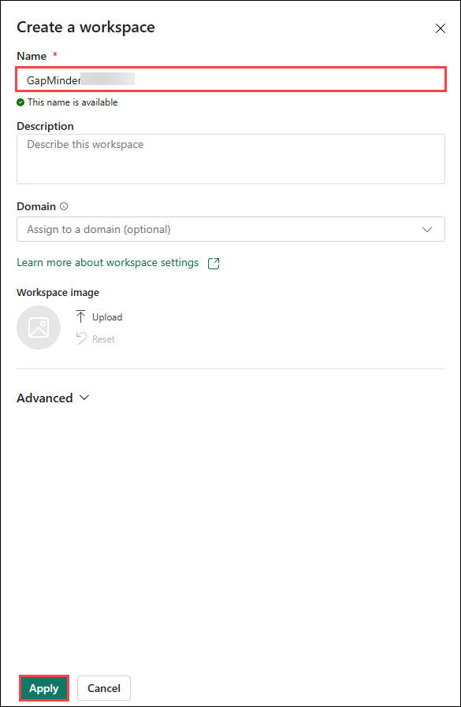
   
1. Once the workspace is created, navigate to your workspace and click on **+ New item**.

   

1. In the **New item** pane, select **Lakehouse**.

   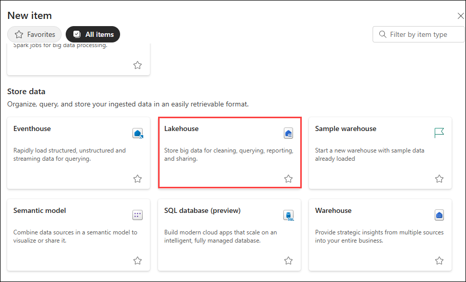

1. Provide the Name as **GapMinder**.

   

1. Once after creating, you will be navigateed to **GapMinder** lakehouse page, which you have just created.

   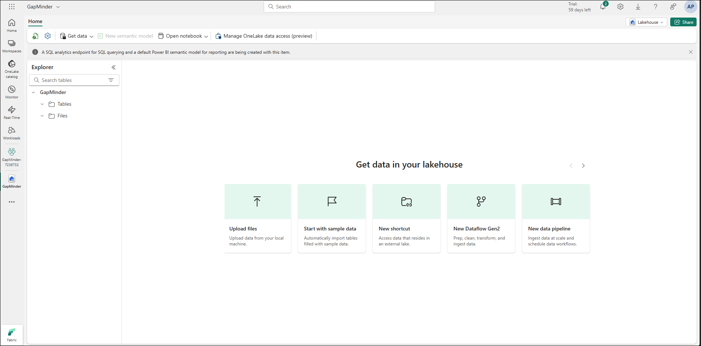

## Task 3: Virtualize data from an Amazon S3 bucket using shortcuts

In this task, you will onboard the REGIONS.csv file from an Amazon S3 bucket into the Fabric Lakehouse using a Shortcut. This allows you to virtualize external data without physically moving it into Fabric, enabling seamless integration and analysis.

1. In the **GapMinder** lakehouse page, select **...** for **Files** and click on **New shortcut**.

   

1. Select **Amazon S3** under **External sources**.

   

1. On the **Connection settings** pane, provide the following details and click on **Next**.

   | Key    | Value                                                |
   |--------|------------------------------------------------------|
   | Url | https://fabric-onelake-regions.s3.eu-north-1.amazonaws.com |
   | Connection name | leave as default |
   | Access key Id |  |
   | Secret Access key |  |

   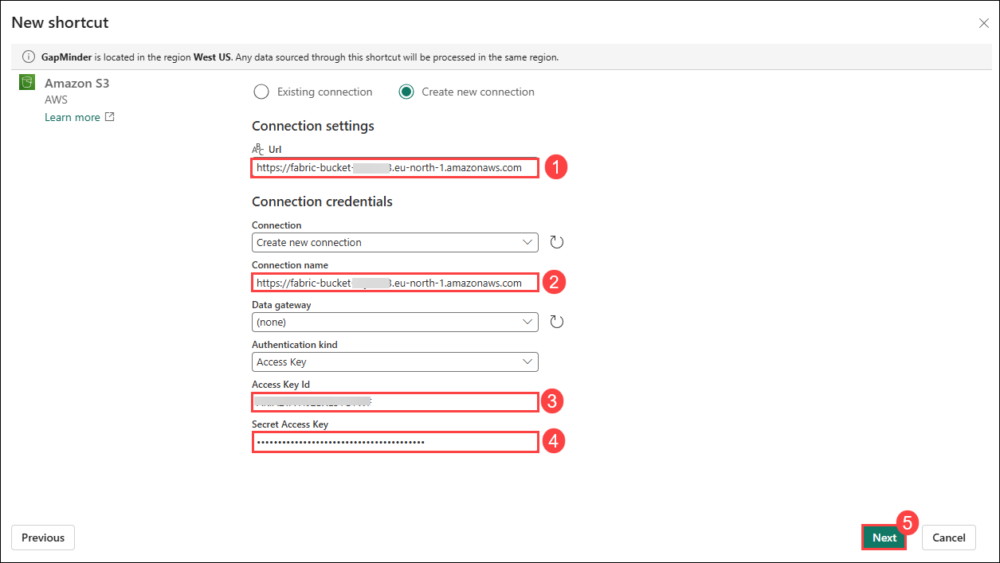

1. In the next pane, click on **Skip**.

   

1. In the next pane, select **fabric-onelake-regions** and click on **Next**.

   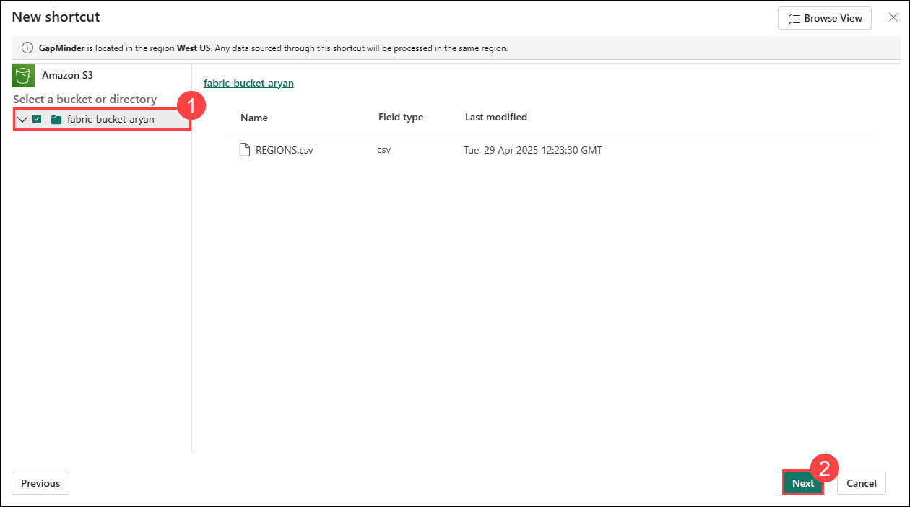

1. Once done, click on **Create** to create the shortcut.

   

1. Once created, you will be able to see that the shorcut is successfully created.

   

## Task 4: Mirror POPULATION table from the Snowflake database into a Microsoft Fabric Lakehouse 

In this task, you will mirror the POPULATION.csv dataset from a Snowflake account into the Fabric environment. This ensures the data is continuously replicated for consistency, enabling real-time access and analysis without manual imports.

1. Navigate to your workspace and click on **+ New item**.

   

1. From the list, select **Mirrored Snowflake**.

   

1. In the next pane, select **Snowflake**.

   

1. On the connection settings pane, provide the following details and click on **Connect**.

   | Key    | Value                                                |
   |--------|------------------------------------------------------|
   | Server | Snowflake URL |
   | Warehouse | warehousename |
   | Username | Username |
   | Password | Password |

   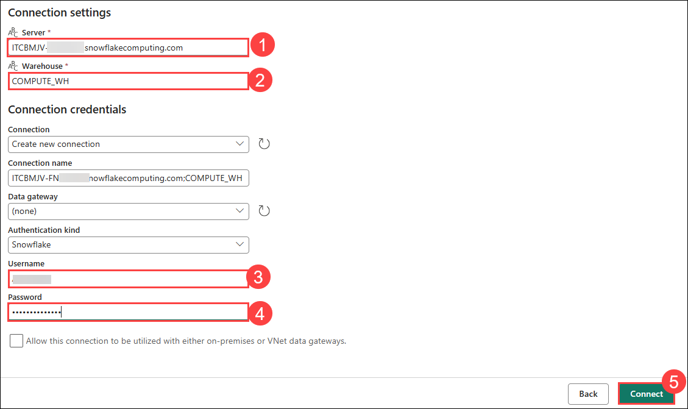

1. In the next pane, select **POPULATIONFORECASTS** database and click on **Connect**.

   

1. In the **Choose data** page, check the box for **Select all** option and click on **Connect**.

   

1. In the destination pane, click on **Create mirrored database**.

   

1. Once done, now you can see the Status as **Running** for Mirroring process, this may take some time, please continue with the further tasks.

   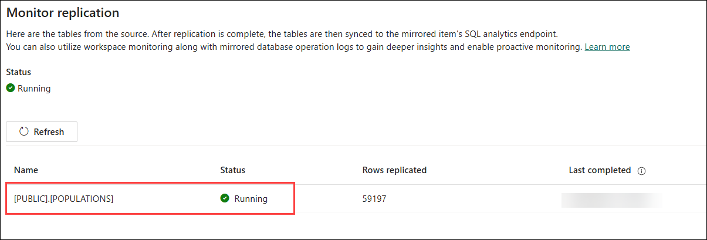

## Task 5: Ingest data from Azure SQL Database to Fabric Lakehouse

In this task, you will ingest the GDP_PER_CAPITA.csv and LIFE_EXPECTANCY.csv datasets from an Azure SQL Database into the Fabric Lakehouse using a data pipeline. This step enables seamless data movement from your source database into Fabric for unified analysis and reporting.

1. Navigate to your workspace and click on **+ New item**.

   

1. From the list, select **Data pipeline**.

   

1. Provide the name as **GapminderPipeline** and click on **Create**.

   

1. Once created, select **Copy data assistant** option.

   

1. In the next pane, select **Azure SQL database**.

   

1. In the **Connect to data source** page, provide the following details and click on **Next**.

   | Key    | Value                                                |
   |--------|------------------------------------------------------|
   | Server | sql-fabric-<inject key="DeploymentID" enableCopy="false"/>.database.windows.net |
   | Database | olcs |
   | Username | labsqladmin |
   | Password | Smoothie@2025 |

   

1. In the next pane to select tables, Check the box for **Select all** option and click on next.

   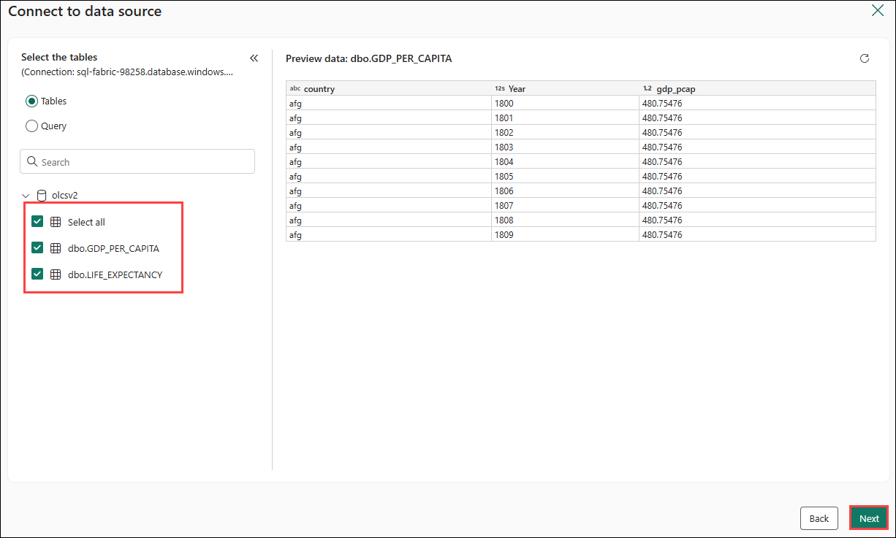

1. Choose **GapMinder** Lakehouse as the destination.

   

1. In the next pane, make sure two tables are present and click on **Next**.

   

1. Click on **Save + Run**.

   

1. Once done, a pop up will be opened for paramaters, leave all the default settings and click on **Ok**.

   

1. Once done, you will see a pipeline running, wait till the **Activity status** changes to **Succeeded**.

   

## Task 6: Add Virtualized and Replicated Data to the Lakehouse

In this task, you will load the REGIONS.csv file from the source folder into a Lakehouse table. This step transforms the virtualized shortcut into a structured table format, making it queryable through the Lakehouse SQL endpoint.

1. Open the GapMinder Lakehouse and switch to the **SQL Analytics Endpoint View**.

   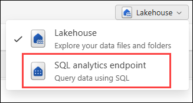

1. On the **Explorer** pane from the left, click on **+ Warehouses**.

   

1. Select **POPULATIONFORECASTS** warehouse and click on **Confirm**.

   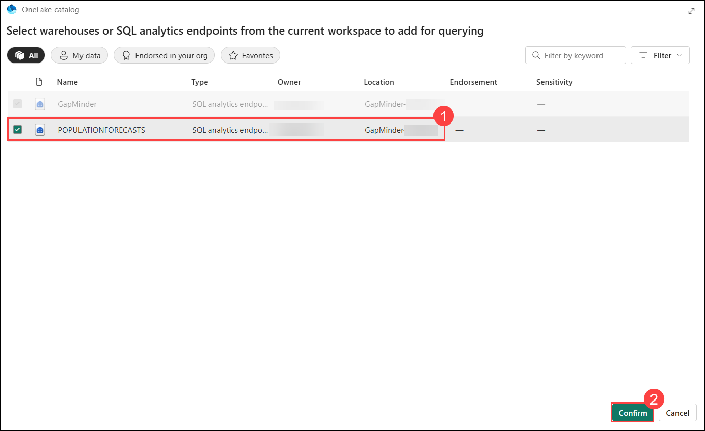

1. Switch back to the **Lakehouse View**.

1. Right-click the `fabric-onelake-regions` folder under Files and select **Load to Tables** and click on **New table**.

   

1. On the **Load folder to new table**, provide **New table name** as **REGIONS** and **File type** as **csv**. Click on **Load**.

   

1. Once completed, you can verify that REGIONS table is created under **Tables**.

   

## Task 7: Create the Views Needed for the Visualization

In this task, you will create SQL views in the Fabric Lakehouse using the SQL Analytics Endpoint. These views will join and organize data from multiple sources—GDP, life expectancy, population, and regions—into a unified format for analysis and visualization.

1. In the **SQL Endpoint View**, click **New SQL Query** and paste the following SQL:

   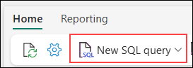

1. Paste the following query in the text area, and click on **RUN** to run the query.

   ```
   DROP VIEW IF EXISTS [dbo].[GapMinder_GDPPerCapita_BaseView];
   GO 
   CREATE VIEW [dbo].[GapMinder_GDPPerCapita_BaseView]
   AS 
   SELECT country, Year, gdp_pcap
   FROM [dbo].[dbo_GDP_PER_CAPITA];
   GO

   DROP VIEW IF EXISTS [dbo].[GapMinder_LifeExpectancy_BaseView];
   GO 
   CREATE VIEW [dbo].[GapMinder_LifeExpectancy_BaseView]
   AS 
   SELECT country, year, lex
   FROM [dbo].[dbo_LIFE_EXPECTANCY];
   GO

   DROP VIEW IF EXISTS [dbo].[GapMinder_Regions];
   GO 
   CREATE VIEW [dbo].[GapMinder_Regions] 
   AS 
   SELECT CountryKey, Region, SubRegion, Country
   FROM [dbo].[regions];
   GO

   DROP VIEW IF EXISTS [dbo].[GapMinder_Population];
   GO CREATE VIEW [dbo].[GapMinder_Population]
   AS 
   SELECT COUNTRY, TIME AS YEAR, POP AS POP, METADATA$ROW_ID 
   FROM [POPULATIONFORECASTS].[PUBLIC].[POPULATIONS];
   GO

   DROP VIEW IF EXISTS [dbo].[GapMinder_Facts]
   GO
   CREATE VIEW [dbo].[GapMinder_Facts]
   AS
   SELECT pop.COUNTRY as countrykey, pop.YEAR as [year]
   , lex.lex as lifeexpectancy
   , gdppcap.gdp_pcap as income_per_capita
   ,pop.POP as population
   FROM [dbo].[GapMinder_Population] pop
   INNER JOIN [dbo].[GapMinder_LifeExpectancy_BaseView] lex ON pop.COUNTRY = lex.country AND pop.YEAR = lex.year
   INNER JOIN [dbo].[GapMinder_GDPPerCapita_BaseView] gdppcap ON pop.COUNTRY = gdppcap.country AND pop.YEAR = gdppcap.Year
   ```

   

1. Once succeeded, you can see the message similar to this.

   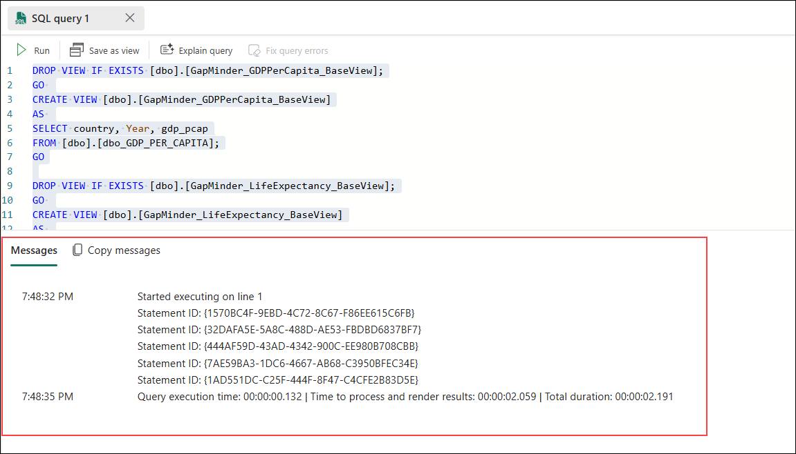

## Task 8: Build Your Visualization

In this task, you will use Power BI Desktop to connect to the Fabric Lakehouse SQL Endpoint and build a dynamic GapMinder-style scatter chart. This visualization will show the relationship between income per capita and life expectancy over time, with bubble size representing population and colors indicating regions.

1. In JumpVM, double click on **Power BI Desktop** from the desktop.

   

1. Inside **Power BI Desktop**, select **Blank report**.

1. Click the **OneLake data hub** button from the top menu.

   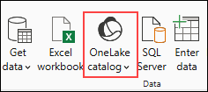

1. 1. In the **Enter your email address** pop up, provide **Email** as **<inject key="AzureAdUserEmail"></inject>** and click on **Continue**.

   

1. If alerts for Sign in, enter the provided email or username, and click **Next** to proceed.

   - Email/Username: <inject key="AzureAdUserEmail"></inject>

     

1. Now, enter the following password and click on **Sign in**.

   - Password: <inject key="AzureAdUserPassword"></inject>

     

1. In the next pane, click on **No, this app only**.

   

1. Select the GapMinder Lakehouse, click the down-arrow on **Connect**, and choose **Connect to SQL Endpoint**.

   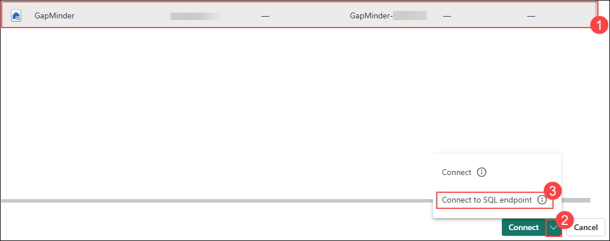

1. Once after clicking on connect, you will get a pop up to login for office 365, enter the provided email or username, and click **Next** to proceed.

   - Email/Username: <inject key="AzureAdUserEmail"></inject>

     

1. Now, enter the following password and click on **Sign in**.

   - Password: <inject key="AzureAdUserPassword"></inject>

     

1. In the Navigator pane, select **GapMinder_Facts**, **GapMinder_Regions** and click on **Load**.

   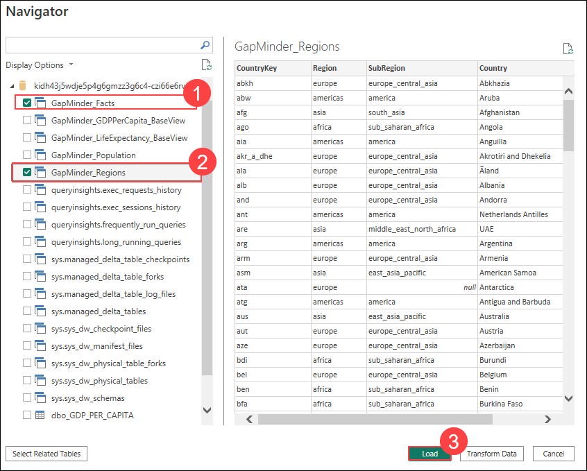

1. In the next pane, select **Import** and click on **OK**.

   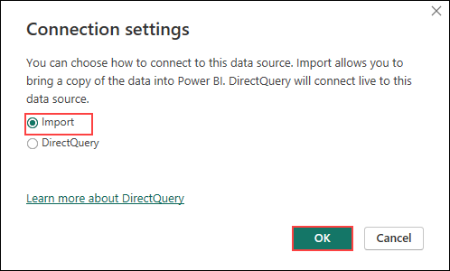

1. Once imported, select the **table view** option from the left menu.

   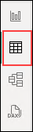

1. From the `GapMinder_Facts` table, select `year`.

   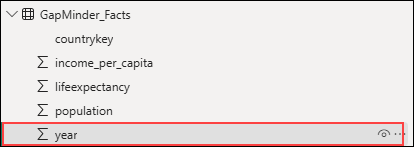

1. Set Summarization to **Don't Summarize**, Format to **Whole Number** from the top menu.

   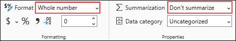

1. Now select, `lifeexpectancy` table.

   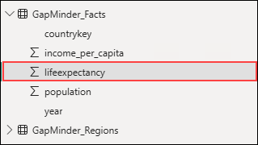

1. Set Summarization to **Average**, Format to **Decimal Number**.

   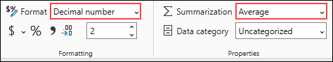

1. Now select, `income_per_capita` table.

   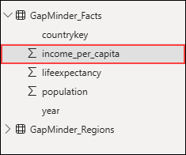

1. Set Summarization to **Average**, Format to **Currency**.

   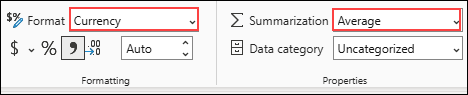

1. Now select, `population` table.

   

1. Set Summarization to **Don't Summarize**.

   

1. Switch to **Report View** using the left menu.

   

1. Now click on **Build visual** option and select **Scatter chart** visualization.

   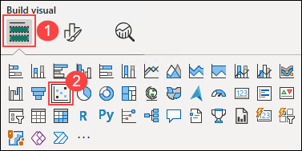

1. In the **Build Visual** pane drag and drop the respective tables to the positions as given below: 

   - Add `GapMinder_Regions.Country` to **Values**.
   - Add `GapMinder_Facts.income_per_capita` to **X-Axis**.
   - Add `GapMinder_Facts.lifeexpectancy` to **Y-Axis**.
   - Add `GapMinder_Regions.SubRegion` to **Legend**.
   - Add `GapMinder_Facts.population` to **Size** (set aggregation to **Sum**).
   - Add `GapMinder_Facts.year` to **Play Axis**.

   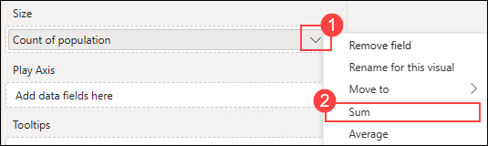

   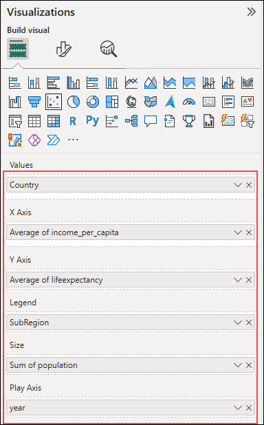

1. Now select the **Format visual** option. 

   

1. Select **X-axis**, enable **Logarithmic scale**, set **Maximum** to 120,000.

   

1. Now you have successfully built a beautiful visualization, the famous Gapminder scatter chart comparing Life Expectancy against Income-per-capita over time.

   

## Summary

In this lab, you have completed a comprehensive end-to-end data onboarding and visualization workflow using Microsoft Fabric. You started by uploading key datasets to Azure SQL Server and then onboarded them into a Fabric Lakehouse. You virtualized external data from Amazon S3 using shortcuts and mirrored population data from a Snowflake database for real-time synchronization. Next, you ingested data from Azure SQL into the Lakehouse, transformed virtualized and replicated data into structured tables, and created SQL views to unify the datasets. Finally, you connected the Lakehouse to Power BI and built a dynamic GapMinder-style scatter chart, visualizing the relationship between income per capita, life expectancy, and population across regions and time.